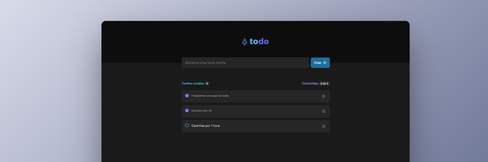
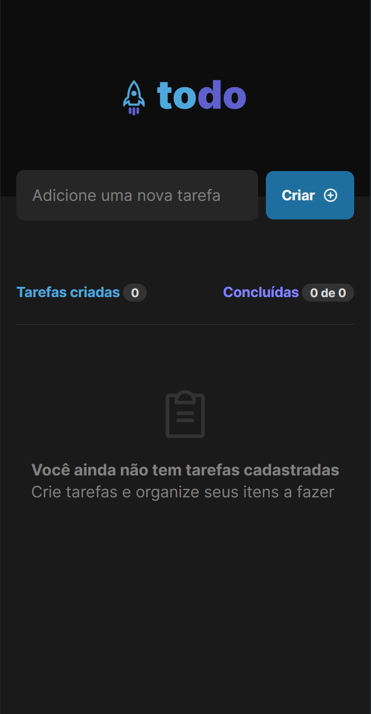
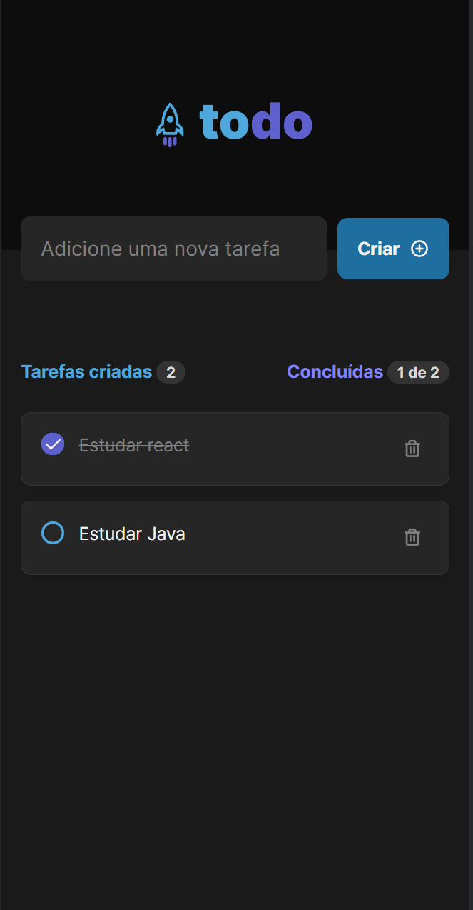
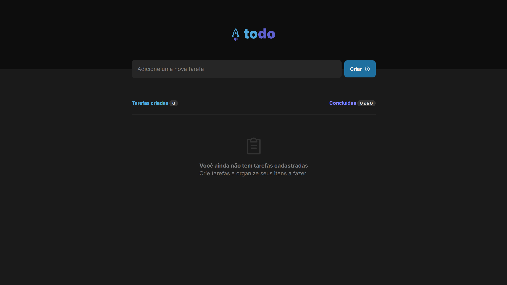
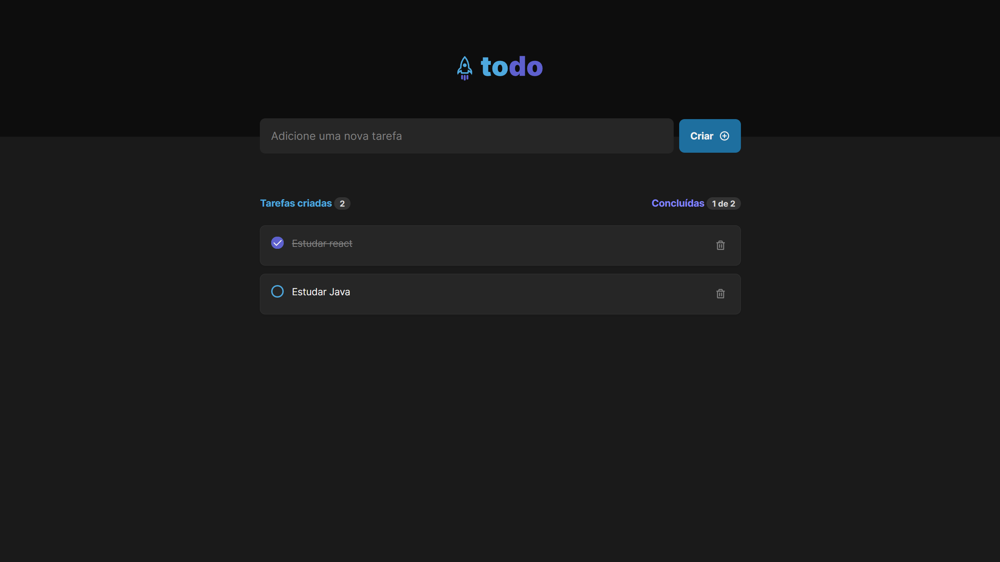

# Todo App

Um app de lista de afazeres feito como forma de estudo do Framework React.

## Tabela de conteúdos

- [Sobre o projeto](#sobre-o-projeto)
- [Screen Shots](#screen-shots)
  - [Web Responsivo (mobile)](#web-responsivo-mobile)
  - [Web Desktop](#web-desktop)
- [Como executar o projeto](#como-executar-o-projeto)
  - [Pré-requisitos](#pré-requisitos)
  - [Rodando o projeto](#rodando-o-projeto)
- [Tecnologias](#tecnologias)
- [Autor](#autor)

## Sobre o projeto

O projeto foi desenvolvido durante o curso da Trilha React Do Ignite da [Rocketseat](https://www.rocketseat.com.br/ignite#trilhas)
no intuito de praticar os conceitos aprendidos durante o módulo de Fundamentos
do ReactJS.

Criação de estados, persistência de dados em Local Storage, criação de hooks
próprios e componentização foram alguns dos conceitos aplicados nessa aplicação.

## Screen Shots

### Web Responsivo (Mobile)

<p>
  
  
  
</p>

### Web Desktop

  
  
  

### Pré-requisitos

Para rodar o projeto, você precisa ter em sua máquina as seguintes ferramentas:
[Git](https://git-scm.com), [Node.js](https://nodejs.org/en/).

### Como rodar o projeto

- Para baixar o projeto é necessário seguir as instruções abaixo:

```bash
# Clone este repositório
$ git clone https://github.com/angelo-filho/todo-list-ignite.git

# Acesse a pasta do projeto
$ cd todo-list-ignite

```

- Instale as dependências e então inicialize o projeto

```bash
# Instale as dependências
$ yarn install

# Execute a aplicação em modo de desenvolvimento
$ yarn dev

```

ou

```bash
# Instale as dependências
$ npm install

# Execute a aplicação em modo de desenvolvimento
$ npm run dev
```

O servidor iniciará na porta:5173 - acesse http://localhost:5173

### Tecnologias

As seguintes ferramentas foram usadas na construção do projeto:

- [React](https://pt-br.reactjs.org/)
- [TypeScript](https://www.typescriptlang.org/)
- [Sass](https://sass-lang.com/)
- [phosphor-react](https://github.com/phosphor-icons/react)

### Autor

<a href="https://github.com/angelo-filho">
  
  <br />
  <sub><b>Angelo Filho</b></sub>
</a>

[](https://www.linkedin.com/in/angelo-filho-4a44a8190/)
[](mailto:angelo.filho06@gmail.com)

Feito com ❤️ por Angelo Filho. Entre em contato!
